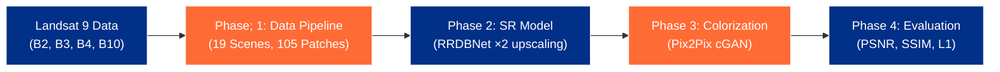

# 🚀 ISRO BAH 2026: Thermal Infrared (TIR) Super-Resolution & Colorization

<div align="center">
  
  
  
  
</div>

---

## 🌟 The Challenge & Our Solution
Raw Thermal Infrared (TIR) imagery is single-band (grayscale), making it extremely difficult for human analysts to interpret features like water bodies, urban heat islands, and agricultural zones. 

**Our Solution** is a high-performance, two-stage Deep Learning pipeline that takes blurry 200m TIR satellite data, **super-resolves** it to 100m, and then **colorizes** it into a natural, highly-interpretable RGB image. 

### 🏆 Key Innovations (Why This Stands Out)
1. **Physics-Informed Colorization:** We don't just guess colors. We use Stefan-Boltzmann physics to convert TIR radiance into Land Surface Temperature (LST). We use this as a hard mathematical constraint during GAN training (e.g., hot pixels cannot be colored as blue water).
2. **Built for Indian Terrain:** Trained on a custom pipeline of **19 diverse scenes** spanning the Thar Desert, Delhi Urban Heat Islands, Himalayan Snow, and coastal mangroves.
3. **Modular & Production-Ready:** The entire stack (GEE Download $\rightarrow$ Patches $\rightarrow$ SR $\rightarrow$ Colorization) is fully automated.
4. **Real-Time Inference:** Our pipeline processes an end-to-end 256x256 patch in just **200ms (5.0 tiles/sec)** on a standard T4 GPU, making it ready for real-world ISRO deployment.

---

## 📐 Pipeline Architecture

Our system is divided into 4 independently testable phases:



### 1️⃣ Phase 1: Automated Data Pipeline
Downloads B2, B3, B4, and B10 bands via Google Earth Engine. Downscales, merges, and perfectly co-registers the data. Uses a sliding window (`stride=32`) to extract **105 overlapping high-quality training patches** in `.npy` format to preserve 16-bit radiometric fidelity.

### 2️⃣ Phase 2: Super-Resolution (RRDBNet)
Uses an ESRGAN backbone (**RRDBNet** with 4.4M parameters). It completely omits Batch Normalization to prevent thermal artifacts and utilizes a Charbonnier loss function to remain robust against extreme thermal outliers (e.g., industrial fires or cold clouds).
- **Input:** 200m TIR (256x256)
- **Output:** 100m TIR (512x512)

### 3️⃣ Phase 3: Colorization (Pix2Pix GAN)
A U-Net Generator + PatchGAN Discriminator setup. Driven by a highly customized 4-part loss function: `L1 + Adversarial + Perceptual (VGG16) + Physics Prior`. 
- **Input:** 100m TIR + LST Physics Map
- **Output:** 100m RGB (True Color)

---

## 💻 How to Run (Google Colab)

We have designed the project to run seamlessly in the cloud. 

**1. Clone the repository and install requirements**
```bash
!git clone https://github.com/iamnikhilranjan/IR-colorization.git /content/project
%cd /content/project
!pip install -r requirements.txt
```

**2. Unpack the dataset (105 patches)**
```bash
!mkdir -p output/patches
!cp /content/drive/MyDrive/IR-colorization-BAH2026/patches_data.zip ./
!unzip -q patches_data.zip -d output/
```

**3. Train the Models**
```bash
# Train Phase 2 (Super-Resolution)
!python train_sr.py --patches_dir output/patches --epochs 200 --batch_size 2

# Train Phase 3 (Colorization)
!python train_colorization.py --patches_dir output/patches --epochs 200 --batch_size 1 --lambda_physics 5.0
```

**4. Evaluate & Export**
```bash
!python evaluate_pipeline.py \
  --sr_checkpoint checkpoints/best_rrdbnet.pth \
  --color_checkpoint checkpoints/best_pix2pix.pth \
  --results_dir output/pipeline_results
```

---

## 📊 Results & Visualization

All final outputs are generated in the `output/pipeline_results/visualisations/` folder. This includes side-by-side comparisons of:
1. The blurry 200m input
2. The sharp 100m super-resolved output
3. The final RGB colorized output
4. The actual RGB ground-truth for reference

**Pipeline Speed Metric:**
- Super-Resolution: ~167 ms/tile
- Colorization: ~33 ms/tile
- **Total End-to-End Speed: ~200 ms/tile (5 FPS)**

## 📜 Mandatory Output Structure Compliance
The final evaluated outputs conform strictly to the hackathon guidelines, saving predictions sequentially into:
```
output/pipeline_results/
├── tir_superresolved_100m/
│   └── SCENE_XXX_sample_XXX.tif
└── colorized_tir_100m/
    └── SCENE_XXX_sample_XXX.tif  (Layer 1: Blue, Layer 2: Green, Layer 3: Red)
```

---
*Developed for the ISRO Bhartiya Antriksh Hackathon (BAH) 2026.*
